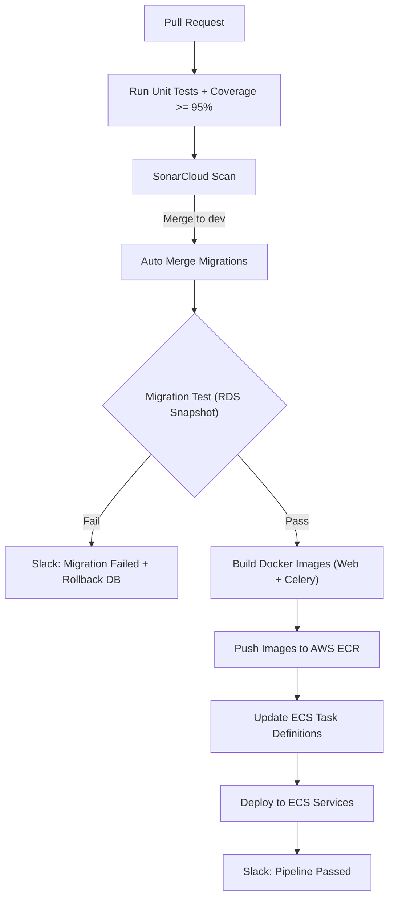

# Django + Celery CI/CD Pipeline (Bitbucket ➜ AWS ECS/ECR)

> 🚀 A production-ready CI/CD pipeline template for Django + Celery applications.  
> Automates testing, quality checks, DB migration validation, container builds, and AWS ECS/ECR deployments with Slack notifications.

---

## 📌 About This Project  

This repository demonstrates a **full-fledged CI/CD pipeline** that I designed and implemented to handle the **end-to-end lifecycle** of a Django + Celery application.  

It reflects my **DevOps expertise** across:  
- ✅ Conditional PR validation  
- ✅ Automated unit testing with coverage enforcement  
- ✅ SonarCloud code quality gates  
- ✅ Auto-handling of migrations post-merge  
- ✅ Secure DB migration validation using **restored RDS snapshots**  
- ✅ Docker build & tagging strategy (app + celery worker)  
- ✅ AWS ECR push & ECS service updates  
- ✅ Slack notifications (success/failure with duration tracking)  
- ✅ Rollback strategy for safe recovery 

---

## ✨ Features  

- Automated **unit tests** with coverage enforcement  
- **SonarCloud** quality gates for clean code  
- Secure **DB migration validation** using restored RDS snapshots  
- **Docker build & tagging strategy** for app + celery worker  
- AWS **ECR push & ECS deployment**  
- **Slack notifications** with build duration + failure alerts  
- Rollback strategy for ECS service recovery  

---

## ⚙️ Tech Stack  

- **CI/CD**: Bitbucket Pipelines (self-hosted runners)  
- **Runtime**: Django + Celery  
- **Containers**: Docker, Docker Compose, Poetry  
- **Databases**: PostgreSQL, Redis, AWS RDS  
- **Deployment**: AWS ECS (Fargate), AWS ECR  
- **Storage**: AWS S3 (static/media)  
- **Quality Gate**: SonarCloud  
- **Notifications**: Slack Webhooks  

---

## 🔄 CI/CD Workflow  

### 1. Pull Requests (to `dev`, `staging`, `main`)  
- Run **unit tests** with `coverage --fail-under=95`  
- Generate `coverage.xml`  
- Perform **SonarQube scan** with PR decoration  

### 2. Branch: `dev`  

**Step 1 – Auto Merge Migrations**  
- Wait for Postgres readiness  
- Install dependencies with Poetry  
- Run `makemigrations --merge`  
- Auto-commit and push migration files back to `dev`  

**Step 2 – Build + Test + Deploy**  
- Capture pipeline start time  
- Register Slack error handler  
- Build Docker images for:  
  - `web` service (Django + Gunicorn + Nginx)  
  - `celery` worker  
- Apply tagging strategy:  
  - `latest`  
  - `YYYY-MM-DD-<shortSHA>`  

**Migration Test (RDS Snapshot Strategy):**  
- Restore latest **staging RDS snapshot** into a temporary DB  
- Run migrations safely  
- Rollback on failure, delete DB on success  

- Push images to **AWS ECR**  
- Register new **ECS task definitions**  
- Update ECS services with new tasks  
- Send **Slack success message**  

### 3. Rollback Job (Optional)  
- Restore ECS service to a previous Docker image tag  
- Validate rollback images exist  
- Notify Slack on success  

---

## 📊 CI/CD Flow Diagram  




## 📂 Repository Structure  

```bash
.
├── Dockerfile                   # Web app (Django + Nginx + Gunicorn)
├── Dockerfile.Celery             # Celery worker image
├── docker-compose.docker.yml     # Local dev stack (Postgres, Redis, App)
├── docker-compose.bitbucket.yml  # CI-only Postgres service
├── entrypoint.sh                 # Web startup (migrations, collectstatic, gunicorn)
├── entrypoint-celery.sh          # Celery worker startup
├── nginx.conf                    # Nginx reverse proxy config
├── gunicorn.conf.py              # Gunicorn WSGI config
├── bitbucket-pipelines.yml       # Full CI/CD pipeline definition
├── sonar-project.properties      # SonarCloud config
├── .env.example                  # Safe sample env vars
├── scripts/
│   ├── create-new-task-def.sh
│   ├── create-new-task-def-celery.sh
│   └── report-build-result.sh
└── README.md
```